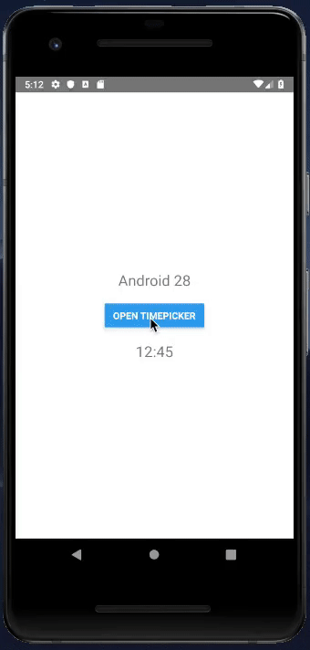
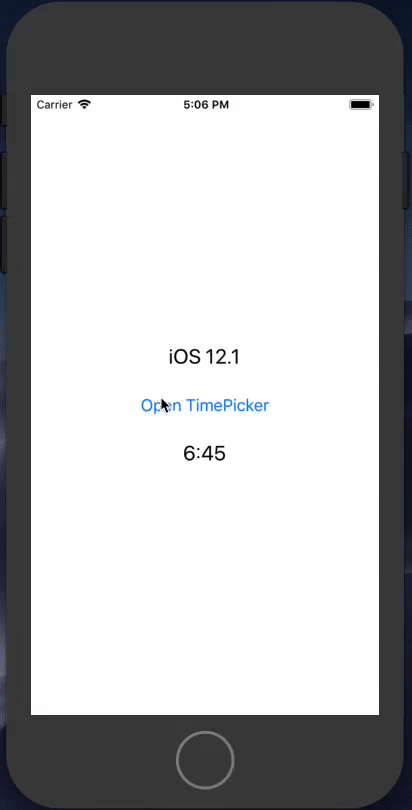

         
    _   _       _   _          _____ _                ____  _      _             
    | \ | | __ _| |_(_)_   ____|_   _(_)_ __ ___   ___|  _ \(_) ___| | _____ _ __ 
    |  \| |/ _` | __| \ \ / / _ \| | | | '_ ` _ \ / _ \ |_) | |/ __| |/ / _ \ '__|
    | |\  | (_| | |_| |\ V /  __/| | | | | | | | |  __/  __/| | (__|   <  __/ |   
    |_| \_|\__,_|\__|_| \_/ \___||_| |_|_| |_| |_|\___|_|   |_|\___|_|\_\___|_|   
                                                                                
# NativeTimePicker

React Native component abstraction for Android and iOS Native Time Pickers

# Demo

          
          

